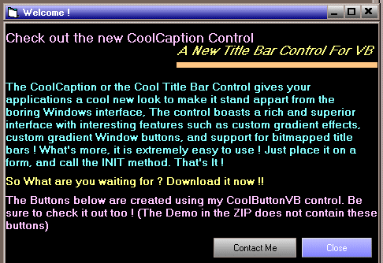



## Cool Title Bar Control

### Description

The Cool Title Bar control allows you to have custom title bars with spectacular gradient effects, image support and also a rich and interactive user interface. The simplicity of this control in terms of use and the power of it will enable even a novice programmer to create eye catching applications.

NOTE:THIS CONTROL HAS NOT BEEN TESTED WITH VB 5/VB 4
 
### More Info
 
NOTE:This control has not been tested with VB 5.0 / 4.0

             |
---                |---
**Submitted On**   |2001-06-28 21:57:56
**By**             |[Srideep Prasad](https://github.com/Planet-Source-Code/PSCIndex/blob/master/ByAuthor/srideep-prasad.md)
**Level**          |Advanced
**User Rating**    |4.0 (16 globes from 4 users)
**Compatibility**  |VB 4\.0 \(32\-bit\), VB 5\.0, VB 6\.0
**Category**       |[Custom Controls/ Forms/  Menus](https://github.com/Planet-Source-Code/PSCIndex/blob/master/ByCategory/custom-controls-forms-menus__1-4.md)
**World**          |[Visual Basic](https://github.com/Planet-Source-Code/PSCIndex/blob/master/ByWorld/visual-basic.md)
**Archive File**   |[Cool Title218496282001\.zip](https://github.com/Planet-Source-Code/srideep-prasad-cool-title-bar-control__1-24515/archive/master.zip)

